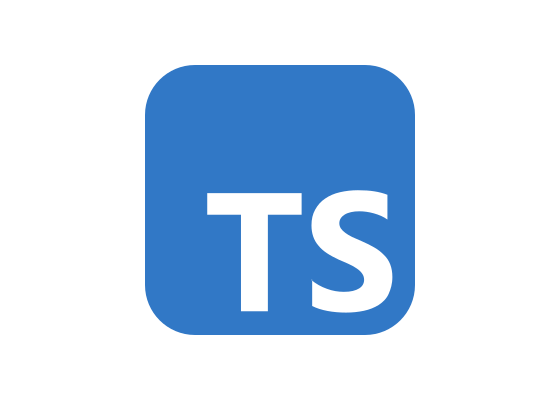

# Dicas de TypeScript

<!--  -->
<div>
  
  
</div>

TypeScript é um superset do JavaScript que adiciona tipagem estática opcional e muitos recursos úteis. Aqui estão algumas dicas para ajudar você a aproveitar ao máximo TypeScript:

## 1. Instalação

- Para instalar TypeScript, use o npm:

```
     npm install -g typescript

```

## 2. Compilação

- Compile seu código TypeScript para JavaScript usando o comando tsc:

```
    tsc arquivo.ts

```

## 3. Configuração do `tsconfig.json`

- Crie um arquivo `tsconfig.json` para configurar o compilador TypeScript. Um exemplo básico:

```
{
  "compilerOptions": {
    "target": "ES2016",
    "module": "commonjs",
    "rootDir": "./src",
    "outDir": "./dist",
    "strict": true,
    "esModuleInterop": true
  },
  "include": ["src/**/*"]
}
```

## 4. Tipagem

- Aproveite a tipagem estática para evitar erros comuns:

```
let mensagem: string = "Olá, TypeScript!";
```

# 5. Interfaces

- Use interfaces para definir contratos claros para seus objetos:

```
interface Pessoa {
  nome: string;
  idade: number;
}

let usuario: Pessoa = {
  nome: "João",
  idade: 30
};

```

## 6. Classes

- Aproveite a orientação a objetos com classes:

```
class Animal {
  nome: string;

  constructor(nome: string) {
    this.nome = nome;
  }

  fazerSom(): void {
    console.log(`${this.nome} está fazendo um som.`);
  }
}

let cachorro = new Animal("Cachorro");
cachorro.fazerSom();
```

## 7. Enums

- Use enums para representar um conjunto de valores nomeados:

```
enum Cor {
  Vermelho,
  Verde,
  Azul
}

let corFavorita: Cor = Cor.Verde;

```

## 8. Tipos de União e Interseção

- Combine tipos com união (|) e interseção (&):

```
let id: string | number;
id = "123";
id = 123;

interface A {
    a: string;
}
interface B {
    b: string;
}

let obj: A & B = {
    a: "foo",
    b: "bar"
};
```

# 9. Generics

- Use generics para criar componentes reutilizáveis:

```
function identidade<T>(valor: T): T {
  return valor;
}

let numero = identidade<number>(10);
let texto = identidade<string>("Olá");

```

## 10. Módulos

- Organize seu código em módulos para uma melhor manutenção:

```
// arquivo: matematicas.ts
export function somar(a: number, b: number): number {
  return a + b;
}

// arquivo: app.ts
import { somar } from './matematicas';

console.log(somar(2, 3));

```

# 11. Type Assertions

- Use assertions para informar ao compilador sobre tipos específicos:

```
let algumValor: any = "isto é uma string";
let comprimentoDaString: number = (algumValor as string).length;

```

## 12. Linting

- Use o TSLint ou o ESLint com a extensão TypeScript para garantir um código limpo e consistente:

```
npm install tslint --save-dev
tslint --init
```

### Recursos Adicionais

- [Documentação Oficial do TypeScript](https://www.typescriptlang.org/pt/docs/handbook/typescript-in-5-minutes.html)
- [Playground do TypeScript](https://www.typescriptlang.org/pt/play/)
- [Guia de Estilo do TypeScript](https://github.com/microsoft/TypeScript/wiki/Coding-guidelines)
